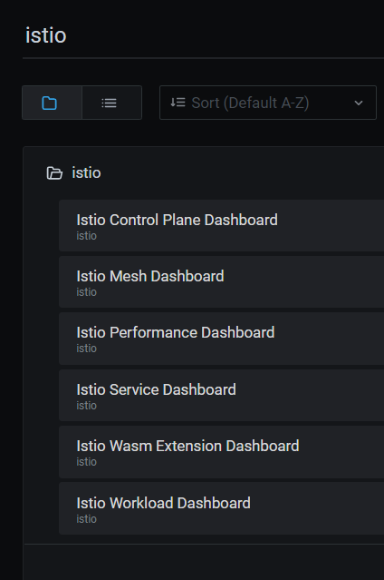

# Notes

## K3d setup steps

```bash

# expose 80/443 through load balancer. 
# expose webapp nodeport on 30080
# expose jaeger ui nodeport on 31001
# expose grafan nodeport on 31002

k3d cluster create lab2 --port 9080:80@loadbalancer --port 9443:443@loadbalancer --port 30080:30080@server:0 --port 31001:31001@server:0 --port 31002:31002@server:0 --api-port 6443 --k3s-arg='--disable=traefik@server:0'
```

```bash
kubectl label namespace default istio-injection=enabled

# Import images for fleetman and istio to speed up setup
k3d images import richardchesterwood/istio-fleetman-position-simulator:6 richardchesterwood/istio-fleetman-position-tracker:6 richardchesterwood/istio-fleetman-api-gateway:6 richardchesterwood/istio-fleetman-webapp-angular:6 richardchesterwood/istio-fleetman-vehicle-telemetry:6 richardchesterwood/istio-fleetman-staff-service:6 docker.io/istio/proxyv2:1.10.3 grafana/grafana:7.2.1 docker.io/istio/pilot:1.10.3 docker.io/jaegertracing/all-in-one:1.20 quay.io/kiali/kiali:v1.23 jimmidyson/configmap-reload:v0.4.0 prom/prometheus:v2.21.0 --cluster lab2
```

Header propagation 
- [example](https://github.com/DickChesterwood/istio-fleetman/blob/6/istio-fleetman-api-gateway/src/main/java/com/virtualpairprogrammers/api/config/PropagateHeadersInterceptor.java) that uses [feign](https://github.com/OpenFeign/feign) library in spring boot:

```java
@Component
public class PropagateHeadersInterceptor implements RequestInterceptor {
	
	private @Autowired HttpServletRequest request;

	public void apply(RequestTemplate template) {
		try
		{
			Enumeration<String> e = request.getHeaderNames();
			while (e.hasMoreElements())
			{
				String header = e.nextElement();
				if (header.startsWith("x-"))
				{
					String value = request.getHeader(header);
					template.header(header, value);
				}
			}
		}
		catch (IllegalStateException e) {}
	}
}
```

- Baeldung link on feign - https://www.baeldung.com/intro-to-feign
- dotnet core feign library - https://github.com/daixinkai/feign.net 
- how to add default header propagation - https://craftbakery.dev/http-header-propagation-aspnet-core/
- https://docs.microsoft.com/en-us/dotnet/api/microsoft.aspnetcore.headerpropagation?view=aspnetcore-6.0
- https://thecodeblogger.com/2021/05/25/request-header-propagation-in-net-core-web-applications/

## Grafana

