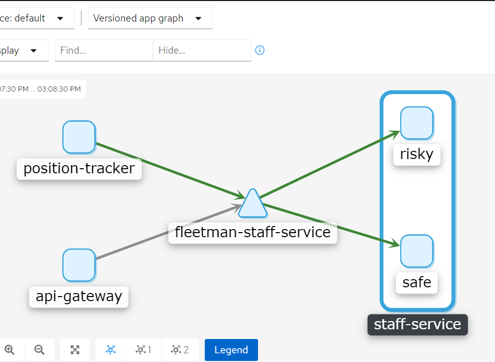
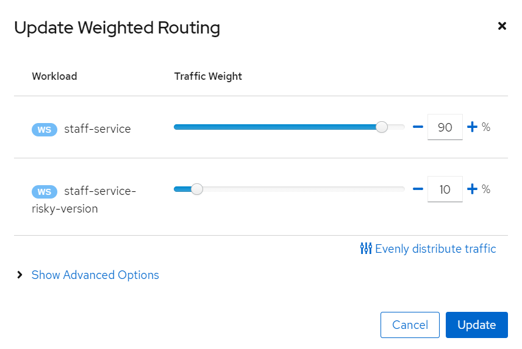
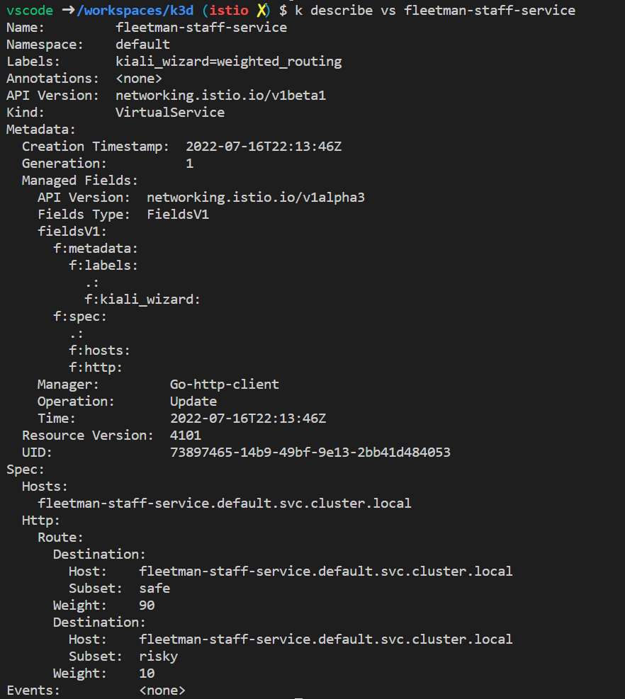
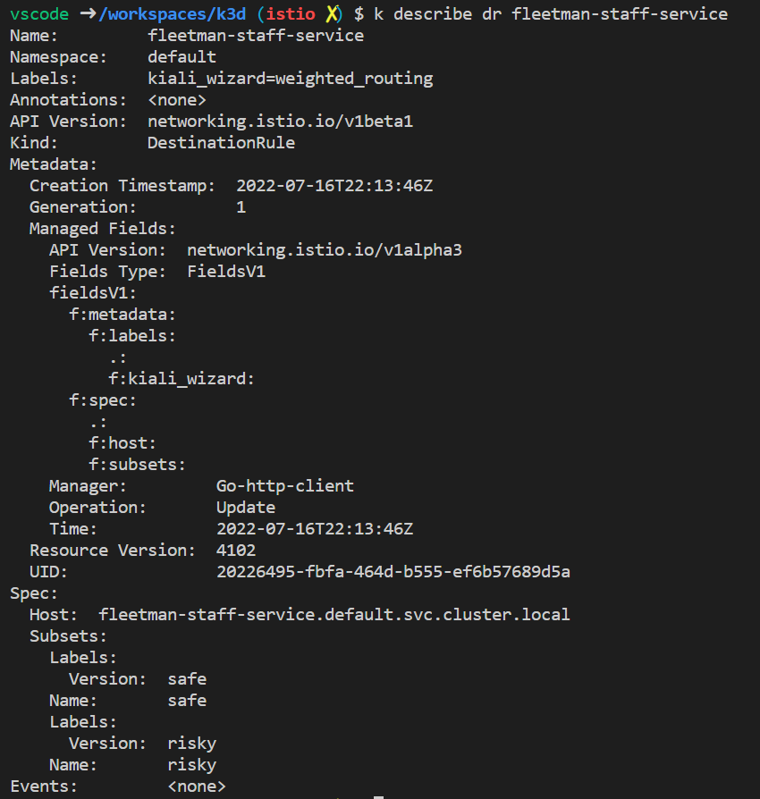

# Notes

## K3d setup steps

```bash

# expose 80/443 through load balancer. 
# expose webapp nodeport on 30080
# expose kiali nodeport on 31000
# expose jaeger ui nodeport on 31001
# expose grafan nodeport on 31002

k3d cluster create lab3 --port 9080:80@loadbalancer --port 9443:443@loadbalancer --port 30080:30080@server:0 --port 31000:31000@server:0 --port 31001:31001@server:0 --port 31002:31002@server:0 --api-port 6443 --k3s-arg='--disable=traefik@server:0'
```

```bash
kubectl label namespace default istio-injection=enabled

# Import images for fleetman and istio to speed up setup
k3d images import richardchesterwood/istio-fleetman-position-simulator:6 richardchesterwood/istio-fleetman-position-tracker:6 richardchesterwood/istio-fleetman-api-gateway:6 richardchesterwood/istio-fleetman-webapp-angular:6 richardchesterwood/istio-fleetman-vehicle-telemetry:6 richardchesterwood/istio-fleetman-staff-service:6 docker.io/istio/proxyv2:1.10.3 grafana/grafana:7.2.1 docker.io/istio/pilot:1.10.3 docker.io/jaegertracing/all-in-one:1.20 quay.io/kiali/kiali:v1.23 jimmidyson/configmap-reload:v0.4.0 prom/prometheus:v2.21.0 --cluster lab3
```

## Notes

List images on aks node using containerd runtime - https://stackoverflow.com/questions/71582111/list-local-container-images-in-aks-nodes

### 21. Canaries w/ replicas
- applying 5.2.yaml (lines 114-162) is the poor man's version of Canary.  Apply it and you should see two pods safe and risky and the fleet management app will show  some drivers with pictures and some without (1/3 with and 2/3 without).

### 22. Version Grouping
- kiali has special meaning for any pod with `label` app.  Versioned app graph works with label `version`

[5.2.yaml](./5.2.yaml)

```yaml
  template: # template for the pods
    metadata:
      labels:
        app: staff-service
        version: safe
```



### 23. Elegant Canaries and Staged Releases

This is done by creating a weighted route on the service.

- Create the weighted route in kiali.
</br> 


- virtual service in istio
</br>


- destination rule in istio
</br>

</br>

### Load Balancing (27/28)


Virtual services allow you to configure the envoy proxy.

## Links

- https://kubernetes.io/docs/concepts/services-networking/service/
- https://kubernetes.io/docs/concepts/services-networking/dns-pod-service/ 
- http://github.com/istio/istio/issues/9764 consistent hasing (session affinity) with weighted routings challenges.
- http://github.com/envoyproxy/envoy/issues/8167 (see the comments at end for some working examples of session affinity with weighted routing.  Specifically https://github.com/istio/istio/issues/9764#issuecomment-1047356408)
